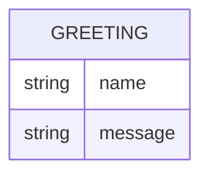

# Domain Model

Greeter has a single, ephemeral concept: the greeting it computes for a request. Nothing is persisted.

- **Greeting** — not stored; constructed per request from the optional `name` query parameter (defaulting when absent) and returned as the response body.

